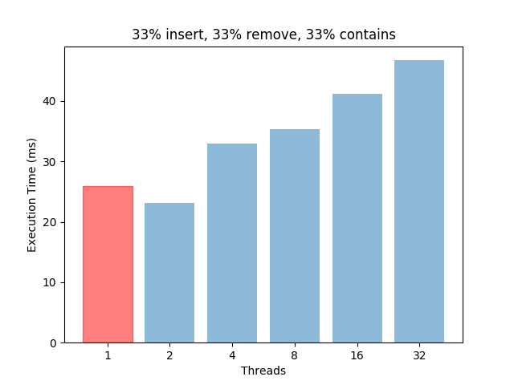
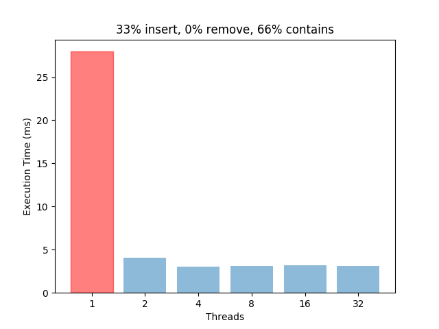
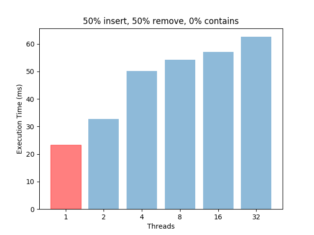

Practical Concurrent Binary Search Trees via Logical Ordering
=============================================================

This is an implementation of the concurrent BST and AVL trees described in the paper by Drachsler et al.

Provided in this repository is a demo cpp file that executes various correctness/efficiency tests of the concurrent designs as compared to a sequential implementation.

Authors
=======

Roman Larionov, Harsh Patel, Khoa Hoang

Building
========

A makefile is provided

Example of how to create a graph for visualizing test results:
```
cd results
./../bst 33 33 33 | python3 ResultVisualizer.py 33 33 33
```

Results
=======

This implementation is optimized for contains operations. Even with relatively similar insert/remove/contains calls, the sequential implementation tends to perform a lot better. This is mainly due to the physical tree locking operations the Logical Ordering AVL tree does during insert/remove.






